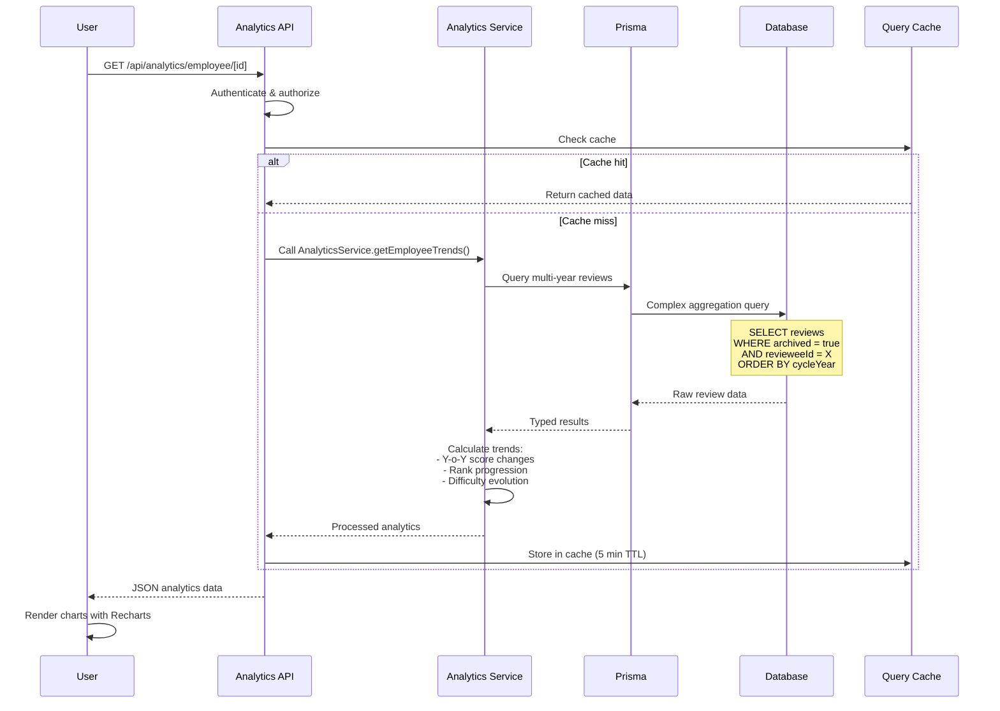

# Analytics & Insights Architecture (Epic 3)

This section details the architecture for Epic 3: Analytics & Insights, which transforms historical performance data into actionable insights through multi-year trend analysis, team analytics, and company-wide reporting.

## Overview

Epic 3 builds on the foundation of archived review data (Epic 2, Story 2.3a) to provide three layers of analytics:
1. **Employee Layer** - Personal performance trends and career progression
2. **Manager Layer** - Team analytics and comparative performance insights
3. **HR Admin Layer** - Company-wide analytics and board reporting

## Analytics Data Flow



## Database Schema Extensions for Analytics

**New Table: UserTransferHistory (Story 3.5)**

```prisma
model UserTransferHistory {
  id              String   @id @default(uuid())
  userId          String
  user            User     @relation(fields: [userId], references: [id])
  
  // Transfer details
  fromDepartment  String
  toDepartment    String
  fromManagerId   String?
  toManagerId     String?
  
  // Transfer metadata
  effectiveDate   DateTime
  reason          String?
  initiatedBy     String   // HR Admin who processed
  
  // Review continuity
  affectedReviewId String? // If mid-cycle transfer
  transferNotes    String? // Context for new manager
  
  createdAt       DateTime @default(now())
  
  @@index([userId, effectiveDate])
  @@index([fromDepartment])
  @@index([toDepartment])
}
```

**Enhanced Review Model for Analytics:**

```prisma
model Review {
  // ... existing fields ...
  
  // Analytics metadata
  difficultyProgression Float?  // Calculated: avg difficulty vs previous year
  performanceChange     Float?  // Y-o-Y score delta
  rankImprovement       Int?    // Rank change: +1 (improved), 0 (same), -1 (declined)
  
  // Transfer tracking
  transferredMidCycle   Boolean @default(false)
  originalManagerId     String? // If transferred
  transferDate          DateTime?
  
  @@index([revieweeId, cycleYear]) // Existing, crucial for trends
  @@index([archived, cycleYear])   // For historical queries
}
```

## Analytics Service Layer

**Core Analytics Service:**

```typescript
// src/lib/analytics/analytics-service.ts
import { prisma } from '@/lib/db/prisma'
import { startOfYear, endOfYear, subYears } from 'date-fns'

export class AnalyticsService {
  /**
   * Story 3.1: Get employee multi-year performance trends
   */
  static async getEmployeePerformanceTrends(employeeId: string, yearsBack: number = 5) {
    // Fetch all archived reviews for employee
    const reviews = await prisma.review.findMany({
      where: {
        revieweeId: employeeId,
        archived: true
      },
      orderBy: { cycleYear: 'asc' },
      select: {
        id: true,
        cycleYear: true,
        finalScore: true,
        finalRank: true,
        employeeTargets: true,
        createdAt: true,
        transferredMidCycle: true
      },
      take: yearsBack
    })
    
    // Calculate trends
    const trends = reviews.map((review, index) => {
      const targets = review.employeeTargets as EmployeeTarget[]
      const avgDifficulty = targets.reduce((sum, t) => {
        return sum + this.getDifficultyValue(t.difficulty)
      }, 0) / targets.length
      
      const previousReview = reviews[index - 1]
      const scoreChange = previousReview 
        ? review.finalScore - previousReview.finalScore 
        : 0
      
      const rankChange = previousReview
        ? this.compareRanks(review.finalRank, previousReview.finalRank)
        : 0
      
      return {
        year: review.cycleYear,
        score: review.finalScore,
        rank: review.finalRank,
        avgDifficulty,
        scoreChange,
        rankChange,
        transferFlag: review.transferredMidCycle,
        targetCount: targets.length
      }
    })
    
    // Calculate career insights
    const insights = this.generateCareerInsights(trends)
    
    return {
      trends,
      insights,
      summary: {
        totalYears: trends.length,
        averageScore: trends.reduce((sum, t) => sum + t.score, 0) / trends.length,
        bestYear: trends.reduce((best, t) => t.score > best.score ? t : best),
        difficultyTrend: this.calculateTrendDirection(trends.map(t => t.avgDifficulty))
      }
    }
  }
  
  /**
   * Story 3.3: Get manager team analytics
   */
  static async getTeamAnalytics(managerId: string, cycleYear?: number) {
    const targetYear = cycleYear || new Date().getFullYear()
    
    // Get all reviews for direct reports
    const reviews = await prisma.review.findMany({
      where: {
        reviewerId: managerId,
        cycleYear: targetYear,
        archived: true
      },
      include: {
        reviewee: {
          select: {
            id: true,
            fullName: true,
            grade: true,
            employeeType: true
          }
        }
      }
    })
    
    // Aggregate team metrics
    const teamMetrics = {
      totalReviews: reviews.length,
      avgScore: reviews.reduce((sum, r) => sum + r.finalScore, 0) / reviews.length,
      rankDistribution: this.calculateRankDistribution(reviews),
      gradeDistribution: this.groupByGrade(reviews),
      completionRate: 100 // All reviews in query are complete
    }
    
    // Individual contributor trends (anonymized for comparison)
    const contributorTrends = await Promise.all(
      reviews.map(async (review) => {
        const history = await this.getEmployeePerformanceTrends(review.revieweeId, 3)
        return {
          employeeId: review.revieweeId, // For drill-down only
          grade: review.reviewee.grade,
          currentScore: review.finalScore,
          currentRank: review.finalRank,
          trend: history.trends.slice(-3) // Last 3 years
        }
      })
    )
    
    // Identify patterns
    const patterns = this.identifyPerformancePatterns(contributorTrends)
    
    return {
      teamMetrics,
      contributorTrends,
      patterns,
      insights: this.generateTeamInsights(teamMetrics, contributorTrends)
    }
  }
  
  /**
   * Story 3.4: Get company-wide analytics
   */
  static async getCompanyAnalytics(cycleYear?: number) {
    const targetYear = cycleYear || new Date().getFullYear()
    
    // Aggregate by department
    const departments = await prisma.review.groupBy({
      by: ['revieweeId'],
      where: {
        cycleYear: targetYear,
        archived: true
      },
      _avg: {
        finalScore: true
      },
      _count: true
    })
    
    // Get all reviews for detailed analysis
    const allReviews = await prisma.review.findMany({
      where: {
        cycleYear: targetYear,
        archived: true
      },
      include: {
        reviewee: {
          select: {
            department: true,
            employeeType: true,
            grade: true
          }
        }
      }
    })
    
    // Group by department
    const departmentStats = this.groupByDepartment(allReviews)
    
    // Company-wide metrics
    const companyMetrics = {
      totalEmployees: allReviews.length,
      avgScore: allReviews.reduce((sum, r) => sum + r.finalScore, 0) / allReviews.length,
      rankDistribution: this.calculateRankDistribution(allReviews),
      departmentComparison: departmentStats,
      topPerformers: this.getTopPerformers(allReviews, 10),
      bottomPerformers: this.getBottomPerformers(allReviews, 10)
    }
    
    // Historical comparison (Y-o-Y)
    const previousYear = await this.getCompanyAnalytics(targetYear - 1)
    const yearOverYear = {
      avgScoreChange: companyMetrics.avgScore - (previousYear?.avgScore || 0),
      rankShifts: this.compareRankDistributions(
        companyMetrics.rankDistribution,
        previousYear?.rankDistribution
      )
    }
    
    return {
      companyMetrics,
      yearOverYear,
      insights: this.generateCompanyInsights(companyMetrics, yearOverYear)
    }
  }
  
  /**
   * Story 3.5: Track employee transfers
   */
  static async getTransferHistory(employeeId: string) {
    const transfers = await prisma.userTransferHistory.findMany({
      where: { userId: employeeId },
      orderBy: { effectiveDate: 'desc' },
      include: {
        user: {
          select: {
            fullName: true,
            employeeId: true
          }
        }
      }
    })
    
    // Get reviews before/after each transfer for impact analysis
    const transferImpacts = await Promise.all(
      transfers.map(async (transfer) => {
        const reviewsBefore = await prisma.review.findFirst({
          where: {
            revieweeId: employeeId,
            cycleYear: { lt: transfer.effectiveDate.getFullYear() }
          },
          orderBy: { cycleYear: 'desc' }
        })
        
        const reviewsAfter = await prisma.review.findFirst({
          where: {
            revieweeId: employeeId,
            cycleYear: { gte: transfer.effectiveDate.getFullYear() }
          },
          orderBy: { cycleYear: 'asc' }
        })
        
        return {
          transfer,
          performanceImpact: {
            scoreBefore: reviewsBefore?.finalScore,
            scoreAfter: reviewsAfter?.finalScore,
            delta: reviewsAfter && reviewsBefore 
              ? reviewsAfter.finalScore - reviewsBefore.finalScore 
              : null
          }
        }
      })
    )
    
    return {
      transfers,
      transferImpacts,
      totalTransfers: transfers.length
    }
  }
  
  // Helper methods
  private static getDifficultyValue(difficulty: string): number {
    const map = { 'L1': 1.25, 'L2': 1.0, 'L3': 0.75 }
    return map[difficulty] || 1.0
  }
  
  private static compareRanks(current: string, previous: string): number {
    const rankOrder = ['C', 'B', 'B+', 'A', 'A+']
    const currentIndex = rankOrder.indexOf(current)
    const previousIndex = rankOrder.indexOf(previous)
    return Math.sign(currentIndex - previousIndex)
  }
  
  private static calculateTrendDirection(values: number[]): 'up' | 'down' | 'stable' {
    if (values.length < 2) return 'stable'
    const slope = (values[values.length - 1] - values[0]) / values.length
    if (slope > 0.05) return 'up'
    if (slope < -0.05) return 'down'
    return 'stable'
  }
  
  private static calculateRankDistribution(reviews: any[]) {
    const distribution: Record<string, number> = {}
    reviews.forEach(r => {
      distribution[r.finalRank] = (distribution[r.finalRank] || 0) + 1
    })
    return distribution
  }
  
  private static groupByDepartment(reviews: any[]) {
    const grouped: Record<string, any> = {}
    
    reviews.forEach(review => {
      const dept = review.reviewee.department
      if (!grouped[dept]) {
        grouped[dept] = {
          department: dept,
          count: 0,
          totalScore: 0,
          ranks: []
        }
      }
      
      grouped[dept].count++
      grouped[dept].totalScore += review.finalScore
      grouped[dept].ranks.push(review.finalRank)
    })
    
    // Calculate averages
    Object.values(grouped).forEach((dept: any) => {
      dept.avgScore = dept.totalScore / dept.count
      dept.rankDistribution = this.calculateRankDistribution(
        dept.ranks.map(r => ({ finalRank: r }))
      )
    })
    
    return Object.values(grouped)
  }
  
  private static identifyPerformancePatterns(trends: any[]) {
    return {
      consistentHighPerformers: trends.filter(t => 
        t.trend.every(y => y.rank === 'A+' || y.rank === 'A')
      ).length,
      improvers: trends.filter(t => {
        const scores = t.trend.map(y => y.score)
        return scores.length >= 2 && scores[scores.length - 1] > scores[0]
      }).length,
      atRisk: trends.filter(t => {
        const scores = t.trend.map(y => y.score)
        return scores.length >= 2 && scores[scores.length - 1] < scores[0]
      }).length
    }
  }
  
  private static generateCareerInsights(trends: any[]) {
    const insights = []
    
    // Check for consistent improvement
    if (trends.length >= 3) {
      const recentScores = trends.slice(-3).map(t => t.score)
      if (recentScores.every((s, i, arr) => i === 0 || s >= arr[i - 1])) {
        insights.push({
          type: 'positive',
          message: 'Consistent performance improvement over the last 3 years'
        })
      }
    }
    
    // Check difficulty progression
    const avgDifficulties = trends.map(t => t.avgDifficulty)
    if (this.calculateTrendDirection(avgDifficulties) === 'up') {
      insights.push({
        type: 'positive',
        message: 'Taking on increasingly challenging targets'
      })
    }
    
    return insights
  }
  
  private static generateTeamInsights(metrics: any, trends: any[]) {
    const insights = []
    
    if (metrics.avgScore > 3.5) {
      insights.push({
        type: 'success',
        message: 'Team performing above company average'
      })
    }
    
    // Check for patterns
    const patterns = this.identifyPerformancePatterns(trends)
    if (patterns.atRisk > 0) {
      insights.push({
        type: 'warning',
        message: `${patterns.atRisk} team member(s) showing declining performance trend`
      })
    }
    
    return insights
  }
  
  private static generateCompanyInsights(metrics: any, yoy: any) {
    const insights = []
    
    if (yoy.avgScoreChange > 0.2) {
      insights.push({
        type: 'positive',
        message: 'Company-wide performance improved year-over-year'
      })
    }
    
    return insights
  }
  
  private static getTopPerformers(reviews: any[], count: number) {
    return reviews
      .sort((a, b) => b.finalScore - a.finalScore)
      .slice(0, count)
      .map(r => ({
        employeeId: r.reviewee.id,
        fullName: r.reviewee.fullName,
        score: r.finalScore,
        rank: r.finalRank
      }))
  }
  
  private static getBottomPerformers(reviews: any[], count: number) {
    return reviews
      .sort((a, b) => a.finalScore - b.finalScore)
      .slice(0, count)
      .map(r => ({
        employeeId: r.reviewee.id,
        fullName: r.reviewee.fullName,
        score: r.finalScore,
        rank: r.finalRank
      }))
  }
  
  private static compareRankDistributions(current: any, previous: any) {
    if (!previous) return {}
    
    const shifts: Record<string, number> = {}
    Object.keys(current).forEach(rank => {
      const currentCount = current[rank] || 0
      const previousCount = previous[rank] || 0
      shifts[rank] = currentCount - previousCount
    })
    
    return shifts
  }
}
```

## API Routes for Analytics

**Employee Analytics API:**

```typescript
// src/app/api/analytics/employee/[id]/route.ts
import { NextRequest, NextResponse } from 'next/server'
import { getServerSession } from 'next-auth'
import { AnalyticsService } from '@/lib/analytics/analytics-service'
import { createSuccessResponse, createErrorResponse } from '@/lib/utils/api-response'

export async function GET(
  request: NextRequest,
  { params }: { params: { id: string } }
) {
  try {
    const session = await getServerSession(authOptions)
    
    if (!session?.user) {
      return NextResponse.json(
        createErrorResponse('Unauthorized', 'AUTH_REQUIRED'),
        { status: 401 }
      )
    }
    
    // Authorization: Employee can only view own analytics, managers/HR can view all
    if (params.id !== session.user.id && 
        !session.user.roles.includes('manager') && 
        !session.user.roles.includes('hr_admin')) {
      return NextResponse.json(
        createErrorResponse('Forbidden', 'NOT_AUTHORIZED'),
        { status: 403 }
      )
    }
    
    // Get query parameters
    const { searchParams } = new URL(request.url)
    const yearsBack = parseInt(searchParams.get('years') || '5')
    
    // Fetch analytics
    const analytics = await AnalyticsService.getEmployeePerformanceTrends(
      params.id,
      yearsBack
    )
    
    return NextResponse.json(createSuccessResponse(analytics))
    
  } catch (error) {
    console.error('Error fetching employee analytics:', error)
    return NextResponse.json(
      createErrorResponse('Failed to fetch analytics', 'SERVER_ERROR'),
      { status: 500 }
    )
  }
}
```

**Manager Team Analytics API:**

```typescript
// src/app/api/analytics/manager/[id]/route.ts
export async function GET(
  request: NextRequest,
  { params }: { params: { id: string } }
) {
  const session = await getServerSession(authOptions)
  
  // Authorization: Manager can only view own team, HR can view all
  if (params.id !== session.user.id && !session.user.roles.includes('hr_admin')) {
    return NextResponse.json(
      createErrorResponse('Forbidden', 'NOT_AUTHORIZED'),
      { status: 403 }
    )
  }
  
  const { searchParams } = new URL(request.url)
  const cycleYear = searchParams.get('year') 
    ? parseInt(searchParams.get('year')) 
    : undefined
  
  const analytics = await AnalyticsService.getTeamAnalytics(params.id, cycleYear)
  
  return NextResponse.json(createSuccessResponse(analytics))
}
```

**Company-Wide Analytics API:**

```typescript
// src/app/api/analytics/hr/route.ts
export async function GET(request: NextRequest) {
  const session = await getServerSession(authOptions)
  
  // Authorization: HR Admin only
  if (!session.user.roles.includes('hr_admin')) {
    return NextResponse.json(
      createErrorResponse('Forbidden', 'HR_ADMIN_ONLY'),
      { status: 403 }
    )
  }
  
  const { searchParams } = new URL(request.url)
  const cycleYear = searchParams.get('year') 
    ? parseInt(searchParams.get('year')) 
    : undefined
  
  const analytics = await AnalyticsService.getCompanyAnalytics(cycleYear)
  
  return NextResponse.json(createSuccessResponse(analytics))
}
```

**Transfer History API:**

```typescript
// src/app/api/analytics/transfers/[id]/route.ts
export async function GET(
  request: NextRequest,
  { params }: { params: { id: string } }
) {
  const session = await getServerSession(authOptions)
  
  // Authorization: Employee (own), Manager (direct reports), HR Admin (all)
  const canAccess = 
    params.id === session.user.id ||
    session.user.roles.includes('manager') ||
    session.user.roles.includes('hr_admin')
  
  if (!canAccess) {
    return NextResponse.json(
      createErrorResponse('Forbidden', 'NOT_AUTHORIZED'),
      { status: 403 }
    )
  }
  
  const history = await AnalyticsService.getTransferHistory(params.id)
  
  return NextResponse.json(createSuccessResponse(history))
}
```

## Visualization Components (Recharts)

**Performance Trend Chart:**

```typescript
// src/components/charts/performance-trend-chart.tsx
'use client'

import { LineChart, Line, XAxis, YAxis, CartesianGrid, Tooltip, Legend, ResponsiveContainer } from 'recharts'

interface PerformanceTrendChartProps {
  data: {
    year: number
    score: number
    rank: string
    avgDifficulty: number
  }[]
}

export function PerformanceTrendChart({ data }: PerformanceTrendChartProps) {
  return (
    <ResponsiveContainer width="100%" height={400}>
      <LineChart data={data} margin={{ top: 5, right: 30, left: 20, bottom: 5 }}>
        <CartesianGrid strokeDasharray="3 3" />
        <XAxis dataKey="year" />
        <YAxis yAxisId="left" domain={[0, 5]} label={{ value: 'Score', angle: -90, position: 'insideLeft' }} />
        <YAxis yAxisId="right" orientation="right" domain={[0.8, 1.6]} label={{ value: 'Avg Difficulty', angle: 90, position: 'insideRight' }} />
        <Tooltip />
        <Legend />
        <Line 
          yAxisId="left"
          type="monotone" 
          dataKey="score" 
          stroke="#8884d8" 
          strokeWidth={3}
          activeDot={{ r: 8 }} 
        />
        <Line 
          yAxisId="right"
          type="monotone" 
          dataKey="avgDifficulty" 
          stroke="#82ca9d" 
          strokeDasharray="5 5"
        />
      </LineChart>
    </ResponsiveContainer>
  )
}
```

**Rank Distribution Chart:**

```typescript
// src/components/charts/rank-distribution-chart.tsx
'use client'

import { BarChart, Bar, XAxis, YAxis, CartesianGrid, Tooltip, Legend, ResponsiveContainer, Cell } from 'recharts'

interface RankDistributionChartProps {
  distribution: Record<string, number>
}

export function RankDistributionChart({ distribution }: RankDistributionChartProps) {
  const data = Object.entries(distribution).map(([rank, count]) => ({
    rank,
    count
  }))
  
  const COLORS = {
    'A+': '#10b981',
    'A': '#3b82f6',
    'B+': '#f59e0b',
    'B': '#ef4444',
    'C': '#6b7280'
  }
  
  return (
    <ResponsiveContainer width="100%" height={300}>
      <BarChart data={data}>
        <CartesianGrid strokeDasharray="3 3" />
        <XAxis dataKey="rank" />
        <YAxis label={{ value: 'Count', angle: -90, position: 'insideLeft' }} />
        <Tooltip />
        <Legend />
        <Bar dataKey="count" name="Employees">
          {data.map((entry, index) => (
            <Cell key={`cell-${index}`} fill={COLORS[entry.rank] || '#8884d8'} />
          ))}
        </Bar>
      </BarChart>
    </ResponsiveContainer>
  )
}
```

**Year-over-Year Comparison:**

```typescript
// src/components/charts/year-over-year-comparison.tsx
'use client'

import { ComposedChart, Bar, Line, XAxis, YAxis, CartesianGrid, Tooltip, Legend, ResponsiveContainer } from 'recharts'

interface YearOverYearComparisonProps {
  currentYear: any[]
  previousYear: any[]
}

export function YearOverYearComparison({ currentYear, previousYear }: YearOverYearComparisonProps) {
  // Merge data for comparison
  const mergedData = currentYear.map((curr, index) => ({
    department: curr.department,
    currentScore: curr.avgScore,
    previousScore: previousYear[index]?.avgScore || 0,
    change: curr.avgScore - (previousYear[index]?.avgScore || 0)
  }))
  
  return (
    <ResponsiveContainer width="100%" height={400}>
      <ComposedChart data={mergedData}>
        <CartesianGrid strokeDasharray="3 3" />
        <XAxis dataKey="department" />
        <YAxis domain={[0, 5]} />
        <Tooltip />
        <Legend />
        <Bar dataKey="currentScore" fill="#8884d8" name="Current Year" />
        <Bar dataKey="previousScore" fill="#82ca9d" name="Previous Year" />
        <Line type="monotone" dataKey="change" stroke="#ff7300" name="Change" />
      </ComposedChart>
    </ResponsiveContainer>
  )
}
```

## Performance Optimization for Analytics

**Query Optimization:**

```typescript
// Indexed queries for fast analytics
// Already defined in schema with:
// @@index([revieweeId, cycleYear])
// @@index([archived, cycleYear])
// @@index([reviewerId, status])

// Use Prisma's aggregation where possible
const aggregated = await prisma.review.aggregate({
  where: { archived: true, cycleYear: 2024 },
  _avg: { finalScore: true },
  _count: true,
  _max: { finalScore: true },
  _min: { finalScore: true }
})

// For complex queries, use raw SQL
const departmentStats = await prisma.$queryRaw`
  SELECT 
    u.department,
    COUNT(*) as review_count,
    AVG(r.finalScore) as avg_score,
    STDDEV(r.finalScore) as score_stddev
  FROM Review r
  JOIN User u ON r.revieweeId = u.id
  WHERE r.archived = true
    AND r.cycleYear = ${targetYear}
  GROUP BY u.department
  ORDER BY avg_score DESC
`
```

**Caching Strategy:**

```typescript
// Use TanStack Query on client for caching
// src/hooks/use-employee-analytics.ts
'use client'

import { useQuery } from '@tanstack/react-query'

export function useEmployeeAnalytics(employeeId: string, yearsBack: number = 5) {
  return useQuery({
    queryKey: ['analytics', 'employee', employeeId, yearsBack],
    queryFn: async () => {
      const response = await fetch(
        `/api/analytics/employee/${employeeId}?years=${yearsBack}`
      )
      return response.json()
    },
    staleTime: 5 * 60 * 1000, // 5 minutes (analytics data changes infrequently)
    cacheTime: 15 * 60 * 1000 // 15 minutes
  })
}
```

**Lazy Loading for Large Datasets:**

```typescript
// Pagination for large result sets
export async function GET(request: NextRequest) {
  const { searchParams } = new URL(request.url)
  const page = parseInt(searchParams.get('page') || '1')
  const pageSize = parseInt(searchParams.get('pageSize') || '20')
  
  const reviews = await prisma.review.findMany({
    where: { archived: true },
    skip: (page - 1) * pageSize,
    take: pageSize,
    orderBy: { cycleYear: 'desc' }
  })
  
  const totalCount = await prisma.review.count({
    where: { archived: true }
  })
  
  return NextResponse.json(createSuccessResponse({
    data: reviews,
    pagination: {
      page,
      pageSize,
      totalPages: Math.ceil(totalCount / pageSize),
      totalCount
    }
  }))
}
```

## Analytics Dashboard Pages

**Employee Dashboard (Story 3.1):**

```typescript
// src/app/(dashboard)/analytics/employee/page.tsx
import { getServerSession } from 'next-auth'
import { AnalyticsService } from '@/lib/analytics/analytics-service'
import { PerformanceTrendChart } from '@/components/charts/performance-trend-chart'
import { Card, CardHeader, CardTitle, CardContent } from '@/components/ui/card'

export default async function EmployeeAnalyticsPage() {
  const session = await getServerSession(authOptions)
  const analytics = await AnalyticsService.getEmployeePerformanceTrends(session.user.id, 5)
  
  return (
    <div className="container mx-auto p-6 space-y-6">
      <h1 className="text-3xl font-bold">My Performance Trends</h1>
      
      <div className="grid grid-cols-1 md:grid-cols-3 gap-4">
        <Card>
          <CardHeader>
            <CardTitle>Average Score</CardTitle>
          </CardHeader>
          <CardContent>
            <p className="text-3xl font-bold">{analytics.summary.averageScore.toFixed(2)}</p>
          </CardContent>
        </Card>
        
        <Card>
          <CardHeader>
            <CardTitle>Total Years</CardTitle>
          </CardHeader>
          <CardContent>
            <p className="text-3xl font-bold">{analytics.summary.totalYears}</p>
          </CardContent>
        </Card>
        
        <Card>
          <CardHeader>
            <CardTitle>Best Year</CardTitle>
          </CardHeader>
          <CardContent>
            <p className="text-3xl font-bold">
              {analytics.summary.bestYear.year} ({analytics.summary.bestYear.rank})
            </p>
          </CardContent>
        </Card>
      </div>
      
      <Card>
        <CardHeader>
          <CardTitle>Performance Trend</CardTitle>
        </CardHeader>
        <CardContent>
          <PerformanceTrendChart data={analytics.trends} />
        </CardContent>
      </Card>
      
      <Card>
        <CardHeader>
          <CardTitle>Career Insights</CardTitle>
        </CardHeader>
        <CardContent>
          <ul className="space-y-2">
            {analytics.insights.map((insight, index) => (
              <li key={index} className="flex items-start">
                <span className={`px-2 py-1 rounded text-xs mr-2 ${
                  insight.type === 'positive' ? 'bg-green-100 text-green-800' : 'bg-blue-100 text-blue-800'
                }`}>
                  {insight.type}
                </span>
                <span>{insight.message}</span>
              </li>
            ))}
          </ul>
        </CardContent>
      </Card>
    </div>
  )
}
```

**Manager Analytics Dashboard (Story 3.3):**

```typescript
// src/app/(dashboard)/analytics/manager/page.tsx
export default async function ManagerAnalyticsPage() {
  const session = await getServerSession(authOptions)
  const analytics = await AnalyticsService.getTeamAnalytics(session.user.id)
  
  return (
    <div className="container mx-auto p-6 space-y-6">
      <h1 className="text-3xl font-bold">Team Analytics</h1>
      
      <div className="grid grid-cols-1 md:grid-cols-4 gap-4">
        <MetricCard title="Team Size" value={analytics.teamMetrics.totalReviews} />
        <MetricCard title="Avg Score" value={analytics.teamMetrics.avgScore.toFixed(2)} />
        <MetricCard title="Completion" value={`${analytics.teamMetrics.completionRate}%`} />
        <MetricCard title="High Performers" value={analytics.patterns.consistentHighPerformers} />
      </div>
      
      <Card>
        <CardHeader>
          <CardTitle>Rank Distribution</CardTitle>
        </CardHeader>
        <CardContent>
          <RankDistributionChart distribution={analytics.teamMetrics.rankDistribution} />
        </CardContent>
      </Card>
      
      <Card>
        <CardHeader>
          <CardTitle>Performance Patterns</CardTitle>
        </CardHeader>
        <CardContent>
          <div className="grid grid-cols-3 gap-4">
            <PatternBadge label="Improvers" count={analytics.patterns.improvers} color="green" />
            <PatternBadge label="At Risk" count={analytics.patterns.atRisk} color="red" />
            <PatternBadge label="Consistent" count={analytics.patterns.consistentHighPerformers} color="blue" />
          </div>
        </CardContent>
      </Card>
      
      <Card>
        <CardHeader>
          <CardTitle>Team Insights</CardTitle>
        </CardHeader>
        <CardContent>
          <InsightsList insights={analytics.insights} />
        </CardContent>
      </Card>
    </div>
  )
}
```

**HR Company-Wide Analytics (Story 3.4):**

```typescript
// src/app/(dashboard)/analytics/hr/page.tsx
export default async function HRAnalyticsPage() {
  const analytics = await AnalyticsService.getCompanyAnalytics()
  
  return (
    <div className="container mx-auto p-6 space-y-6">
      <h1 className="text-3xl font-bold">Company-Wide Analytics</h1>
      
      <div className="grid grid-cols-1 md:grid-cols-4 gap-4">
        <MetricCard title="Total Employees" value={analytics.companyMetrics.totalEmployees} />
        <MetricCard title="Avg Score" value={analytics.companyMetrics.avgScore.toFixed(2)} />
        <MetricCard title="Y-o-Y Change" value={analytics.yearOverYear.avgScoreChange.toFixed(2)} />
        <MetricCard title="Top Performers" value={analytics.companyMetrics.topPerformers.length} />
      </div>
      
      <Card>
        <CardHeader>
          <CardTitle>Department Comparison</CardTitle>
        </CardHeader>
        <CardContent>
          <DepartmentComparisonTable departments={analytics.companyMetrics.departmentComparison} />
        </CardContent>
      </Card>
      
      <Card>
        <CardHeader>
          <CardTitle>Company Rank Distribution</CardTitle>
        </CardHeader>
        <CardContent>
          <RankDistributionChart distribution={analytics.companyMetrics.rankDistribution} />
        </CardContent>
      </Card>
      
      <Card>
        <CardHeader>
          <CardTitle>Year-over-Year Rank Shifts</CardTitle>
        </CardHeader>
        <CardContent>
          <RankShiftTable shifts={analytics.yearOverYear.rankShifts} />
        </CardContent>
      </Card>
    </div>
  )
}
```

## Transfer Tracking Implementation (Story 3.5)

**Transfer Processing Service:**

```typescript
// src/lib/analytics/transfer-service.ts
export class TransferService {
  static async processTransfer(data: {
    userId: string
    fromDepartment: string
    toDepartment: string
    fromManagerId: string
    toManagerId: string
    effectiveDate: Date
    reason?: string
    initiatedBy: string
  }) {
    return await prisma.$transaction(async (tx) => {
      // 1. Create transfer history record
      const transfer = await tx.userTransferHistory.create({
        data: {
          userId: data.userId,
          fromDepartment: data.fromDepartment,
          toDepartment: data.toDepartment,
          fromManagerId: data.fromManagerId,
          toManagerId: data.toManagerId,
          effectiveDate: data.effectiveDate,
          reason: data.reason,
          initiatedBy: data.initiatedBy
        }
      })
      
      // 2. Update user record
      await tx.user.update({
        where: { id: data.userId },
        data: {
          department: data.toDepartment,
          managerId: data.toManagerId
        }
      })
      
      // 3. Handle mid-cycle transfer if active review exists
      const activeReview = await tx.review.findFirst({
        where: {
          revieweeId: data.userId,
          archived: false,
          status: {
            notIn: ['self_eval_draft', 'archived']
          }
        }
      })
      
      if (activeReview) {
        await tx.review.update({
          where: { id: activeReview.id },
          data: {
            reviewerId: data.toManagerId,
            transferredMidCycle: true,
            originalManagerId: data.fromManagerId,
            transferDate: data.effectiveDate
          }
        })
        
        // Link transfer to affected review
        await tx.userTransferHistory.update({
          where: { id: transfer.id },
          data: {
            affectedReviewId: activeReview.id,
            transferNotes: `Review in progress transferred from ${data.fromDepartment} to ${data.toDepartment}`
          }
        })
      }
      
      // 4. Audit log
      await tx.auditEntry.create({
        data: {
          actorId: data.initiatedBy,
          actorRole: 'hr_admin',
          action: 'employee_transfer',
          targetType: 'user',
          targetId: data.userId,
          details: {
            transfer: {
              from: { department: data.fromDepartment, managerId: data.fromManagerId },
              to: { department: data.toDepartment, managerId: data.toManagerId },
              effectiveDate: data.effectiveDate,
              affectedReview: activeReview?.id
            }
          }
        }
      })
      
      return transfer
    })
  }
}
```

---
