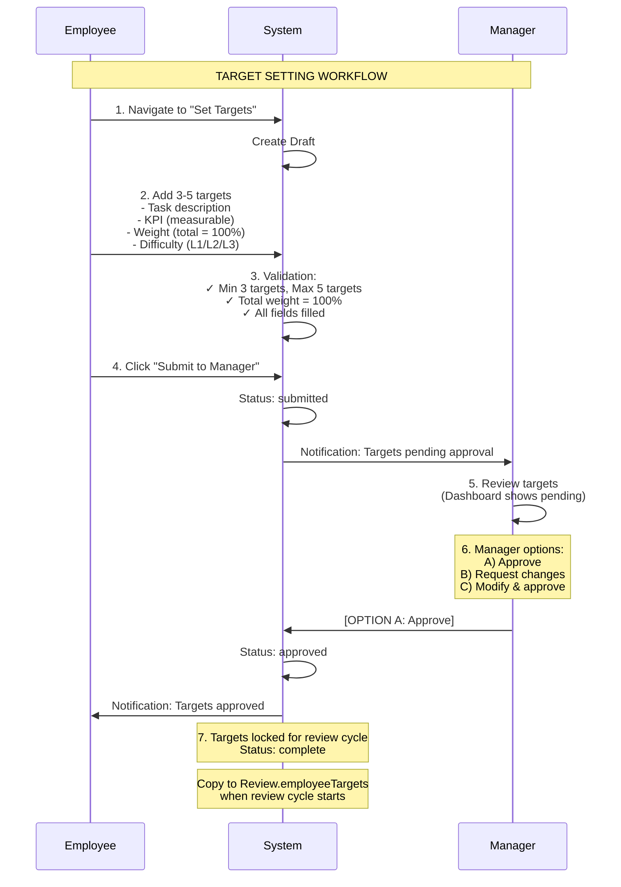
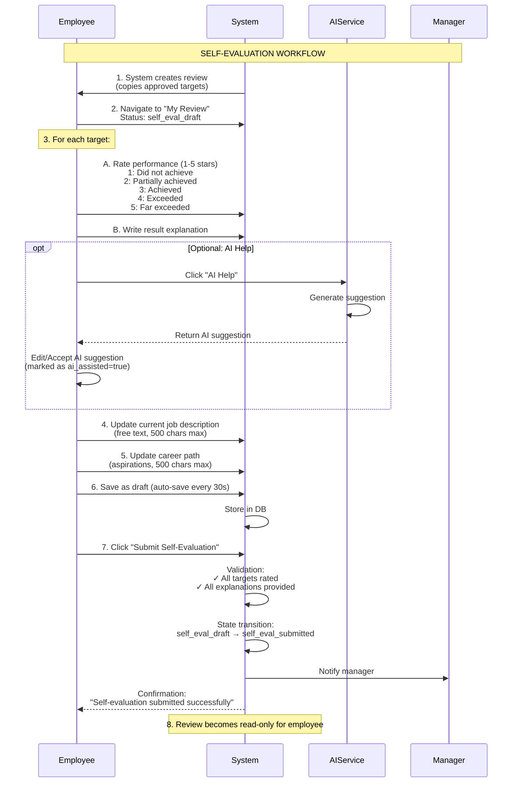
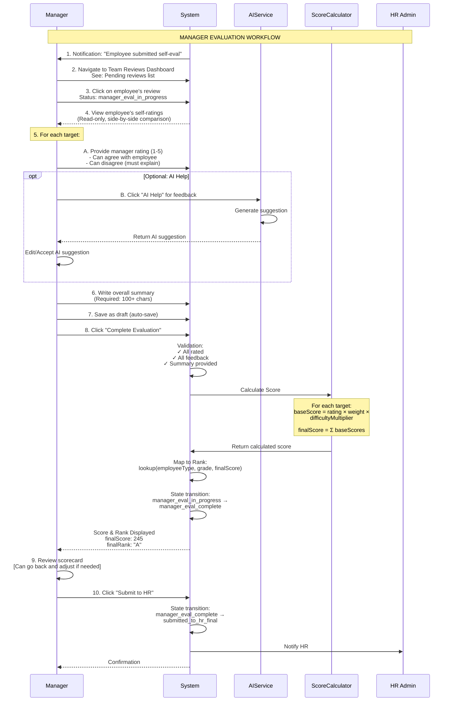
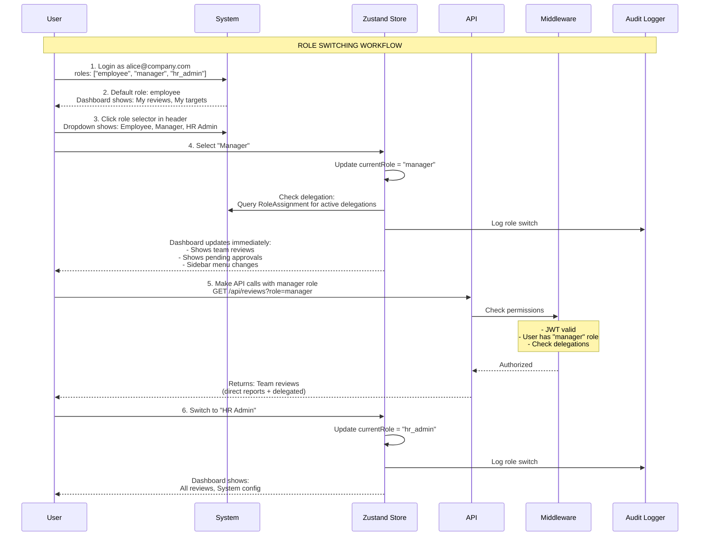
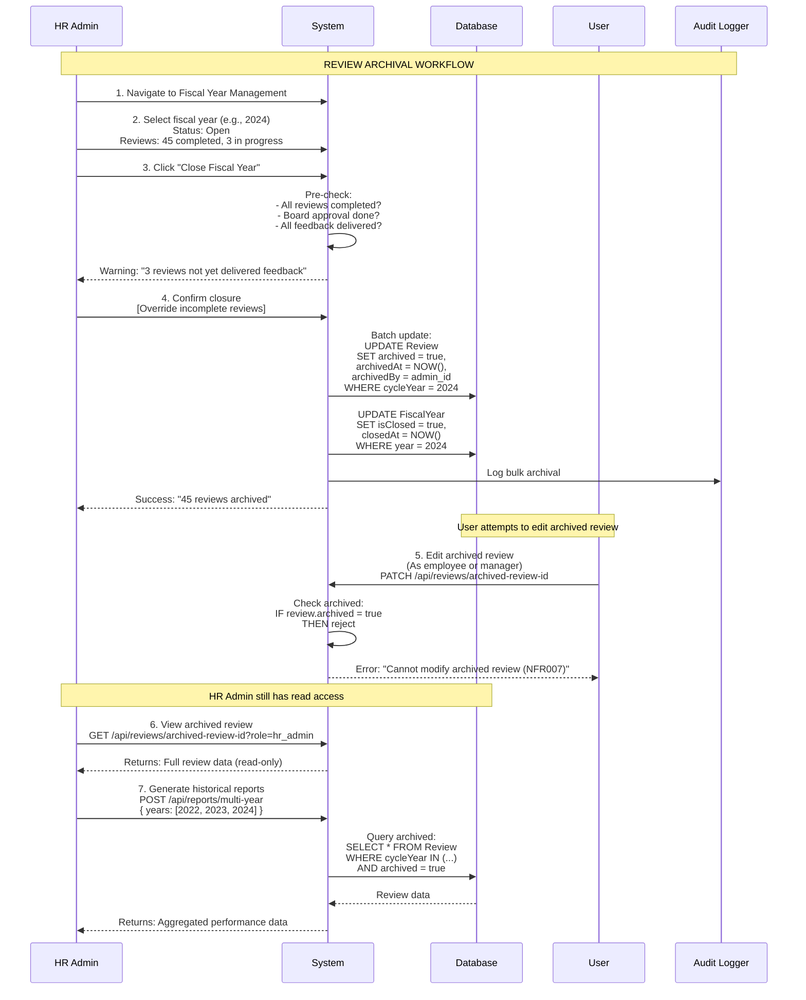

# Core Workflows

This section documents the key business workflows that drive the performance review system. Each workflow includes sequence diagrams, implementation details, and validation rules.

## Workflow 1: Target Setting Process

**Actors:** Employee, Manager, System  
**Trigger:** Start of fiscal year or new employee onboarding  
**Outcome:** Approved target set ready for performance evaluation



**Implementation:**

```typescript
// src/app/api/targets/route.ts
import { NextRequest, NextResponse } from 'next/server'
import { getServerSession } from 'next-auth'
import { prisma } from '@/lib/db/prisma'
import { TargetSetSchema } from '@/lib/validation/target-schemas'
import { AuditLogger } from '@/lib/audit/audit-logger'

export async function POST(request: NextRequest) {
  const session = await getServerSession(authOptions)
  
  // 1. Authentication check
  if (!session?.user) {
    return NextResponse.json(
      createErrorResponse('Unauthorized', 'AUTH_REQUIRED'),
      { status: 401 }
    )
  }
  
  // 2. Parse and validate request
  const body = await request.json()
  const validation = TargetSetSchema.safeParse(body)
  
  if (!validation.success) {
    return NextResponse.json(
      createErrorResponse('Validation failed', 'VALIDATION_ERROR', validation.error),
      { status: 400 }
    )
  }
  
  const { targets } = validation.data
  
  // 3. Check for existing target set
  const existing = await prisma.targetSetting.findUnique({
    where: {
      employeeId_cycleYear: {
        employeeId: session.user.id,
        cycleYear: new Date().getFullYear()
      }
    }
  })
  
  if (existing && existing.status !== 'draft') {
    return NextResponse.json(
      createErrorResponse('Target set already submitted', 'ALREADY_SUBMITTED'),
      { status: 409 }
    )
  }
  
  // 4. Create or update target set
  const targetSetting = await prisma.targetSetting.upsert({
    where: {
      employeeId_cycleYear: {
        employeeId: session.user.id,
        cycleYear: new Date().getFullYear()
      }
    },
    create: {
      employeeId: session.user.id,
      managerId: session.user.managerId,
      cycleYear: new Date().getFullYear(),
      status: 'draft',
      targets: targets
    },
    update: {
      targets: targets,
      updatedAt: new Date()
    }
  })
  
  // 5. Audit log
  await AuditLogger.logAction({
    actorId: session.user.id,
    actorRole: 'employee',
    action: 'create_targets',
    targetType: 'target_setting',
    targetId: targetSetting.id,
    details: { targetCount: targets.length }
  })
  
  return NextResponse.json(createSuccessResponse(targetSetting))
}

// Submit targets to manager
export async function PATCH(request: NextRequest) {
  const session = await getServerSession(authOptions)
  const { id, action } = await request.json()
  
  if (action === 'submit') {
    // 1. Validate target set is complete
    const targetSetting = await prisma.targetSetting.findUnique({
      where: { id }
    })
    
    if (!targetSetting || targetSetting.employeeId !== session.user.id) {
      return NextResponse.json(
        createErrorResponse('Not found', 'NOT_FOUND'),
        { status: 404 }
      )
    }
    
    if (targetSetting.status !== 'draft') {
      return NextResponse.json(
        createErrorResponse('Already submitted', 'INVALID_STATUS'),
        { status: 400 }
      )
    }
    
    // 2. Update status
    const updated = await prisma.targetSetting.update({
      where: { id },
      data: {
        status: 'submitted',
        submittedAt: new Date()
      }
    })
    
    // 3. Notify manager
    await NotificationService.notifyTargetSubmission(
      targetSetting.managerId,
      session.user.id,
      targetSetting.id
    )
    
    // 4. Audit log
    await AuditLogger.logAction({
      actorId: session.user.id,
      actorRole: 'employee',
      action: 'submit_targets',
      targetType: 'target_setting',
      targetId: id
    })
    
    return NextResponse.json(createSuccessResponse(updated))
  }
  
  // Manager approval
  if (action === 'approve') {
    const targetSetting = await prisma.targetSetting.findUnique({
      where: { id }
    })
    
    // Authorization check
    if (targetSetting.managerId !== session.user.id) {
      return NextResponse.json(
        createErrorResponse('Unauthorized', 'NOT_AUTHORIZED'),
        { status: 403 }
      )
    }
    
    const updated = await prisma.targetSetting.update({
      where: { id },
      data: {
        status: 'approved',
        approvedAt: new Date()
      }
    })
    
    // Notify employee
    await NotificationService.notifyTargetApproval(
      targetSetting.employeeId,
      targetSetting.id
    )
    
    await AuditLogger.logAction({
      actorId: session.user.id,
      actorRole: 'manager',
      action: 'approve_targets',
      targetType: 'target_setting',
      targetId: id
    })
    
    return NextResponse.json(createSuccessResponse(updated))
  }
}
```

**Validation Rules:**
- Minimum 3 targets, maximum 5 targets
- Total weight must equal exactly 100%
- Each target must have non-empty task description and KPI
- Difficulty must be one of: L1, L2, L3
- Weight must be between 1 and 100
- Cannot submit if already submitted (must be draft status)
- Only assigned manager can approve

---

## Workflow 2: Self-Evaluation Submission

**Actors:** Employee, System  
**Trigger:** Review cycle opens (typically end of fiscal year)  
**Outcome:** Self-evaluation submitted to manager for review



**Implementation:**

```typescript
// src/app/api/reviews/[id]/self-eval/route.ts
export async function PATCH(
  request: NextRequest,
  { params }: { params: { id: string } }
) {
  const session = await getServerSession(authOptions)
  const { employeeTargets, currentJobDesc, careerPath } = await request.json()
  
  // 1. Get review and validate ownership
  const review = await prisma.review.findUnique({
    where: { id: params.id }
  })
  
  if (!review || review.revieweeId !== session.user.id) {
    return NextResponse.json(
      createErrorResponse('Not found', 'NOT_FOUND'),
      { status: 404 }
    )
  }
  
  if (review.status !== 'self_eval_draft') {
    return NextResponse.json(
      createErrorResponse('Cannot edit after submission', 'INVALID_STATUS'),
      { status: 400 }
    )
  }
  
  // 2. Validate employee targets
  const validation = EmployeeTargetsSchema.safeParse(employeeTargets)
  if (!validation.success) {
    return NextResponse.json(
      createErrorResponse('Validation failed', 'VALIDATION_ERROR'),
      { status: 400 }
    )
  }
  
  // 3. Update review
  const updated = await prisma.review.update({
    where: { id: params.id },
    data: {
      employeeTargets,
      currentJobDesc,
      careerPath,
      updatedAt: new Date()
    }
  })
  
  // 4. Audit log
  await AuditLogger.logAction({
    actorId: session.user.id,
    actorRole: 'employee',
    action: 'update_self_eval',
    targetType: 'review',
    targetId: params.id,
    details: {
      aiAssisted: employeeTargets.some(t => t.aiAssisted)
    }
  })
  
  return NextResponse.json(createSuccessResponse(updated))
}

// Submit self-evaluation
export async function POST(
  request: NextRequest,
  { params }: { params: { id: string } }
) {
  const session = await getServerSession(authOptions)
  
  // Use state machine for transition
  try {
    const review = await ReviewStateMachine.transition(
      params.id,
      'self_eval_submitted',
      session.user.id,
      'employee'
    )
    
    return NextResponse.json(createSuccessResponse(review))
  } catch (error) {
    return NextResponse.json(
      createErrorResponse(error.message, 'TRANSITION_ERROR'),
      { status: 400 }
    )
  }
}
```

**Validation Rules:**
- All targets must have a rating (1-5)
- All targets must have result explanation (min 50 chars)
- Current job description required (max 500 chars)
- Career path optional (max 500 chars)
- Cannot submit if status is not `self_eval_draft`
- Auto-save every 30 seconds while editing
- AI assistance must be flagged in data

---

## Workflow 3: Manager Evaluation & Scoring

**Actors:** Manager, System  
**Trigger:** Employee submits self-evaluation  
**Outcome:** Complete review with final score and rank



**Implementation:**

```typescript
// src/lib/scoring/score-calculator.ts
export class ScoreCalculator {
  private static DIFFICULTY_MULTIPLIERS = {
    'L1': 1.0,   // Base difficulty
    'L2': 1.2,   // 20% bonus for higher difficulty
    'L3': 1.5    // 50% bonus for highest difficulty
  }
  
  static calculateReviewScore(review: Review): {
    finalScore: number
    breakdown: ScoreBreakdown[]
  } {
    const targets = review.managerTargetRatings as ManagerRating[]
    const employeeTargets = review.employeeTargets as EmployeeTarget[]
    
    const breakdown: ScoreBreakdown[] = []
    let totalScore = 0
    
    for (let i = 0; i < targets.length; i++) {
      const rating = targets[i].managerRating
      const target = employeeTargets[i]
      
      // Base score: rating × weight
      const baseScore = rating * target.weight
      
      // Apply difficulty multiplier
      const multiplier = this.DIFFICULTY_MULTIPLIERS[target.difficulty]
      const targetScore = baseScore * multiplier
      
      totalScore += targetScore
      
      breakdown.push({
        targetIndex: i,
        taskDescription: target.taskDescription,
        rating,
        weight: target.weight,
        difficulty: target.difficulty,
        multiplier,
        score: targetScore
      })
    }
    
    return {
      finalScore: Math.round(totalScore),
      breakdown
    }
  }
  
  static async mapScoreToRank(
    score: number,
    employeeType: string,
    grade: string
  ): Promise<string> {
    // Lookup score mapping from database
    const mapping = await prisma.scoreMapping.findUnique({
      where: {
        employeeType_grade: {
          employeeType,
          grade
        }
      }
    })
    
    if (!mapping) {
      throw new Error(`No score mapping found for ${employeeType} - ${grade}`)
    }
    
    const mappings = mapping.mappings as ScoreRange[]
    
    // Find matching range
    for (const range of mappings) {
      if (score >= range.min && score <= range.max) {
        return range.rank
      }
    }
    
    throw new Error(`Score ${score} outside valid ranges`)
  }
}

// src/app/api/reviews/[id]/manager-eval/route.ts
export async function POST(
  request: NextRequest,
  { params }: { params: { id: string } }
) {
  const session = await getServerSession(authOptions)
  const {
    managerTargetRatings,
    managerFeedback,
    overallSummary
  } = await request.json()
  
  const review = await prisma.review.findUnique({
    where: { id: params.id },
    include: { reviewee: true }
  })
  
  // Authorization check
  if (review.reviewerId !== session.user.id) {
    return NextResponse.json(
      createErrorResponse('Unauthorized', 'NOT_AUTHORIZED'),
      { status: 403 }
    )
  }
  
  // Calculate score
  const { finalScore, breakdown } = ScoreCalculator.calculateReviewScore({
    ...review,
    managerTargetRatings
  })
  
  // Map to rank
  const finalRank = await ScoreCalculator.mapScoreToRank(
    finalScore,
    review.reviewee.employeeType,
    review.reviewee.grade
  )
  
  // Update review with transaction
  const updated = await prisma.$transaction(async (tx) => {
    const review = await tx.review.update({
      where: { id: params.id },
      data: {
        managerTargetRatings,
        managerFeedback,
        overallSummary,
        finalScore,
        finalRank,
        status: 'manager_eval_complete',
        managerSubmittedAt: new Date()
      }
    })
    
    // Audit log
    await tx.auditEntry.create({
      data: {
        actorId: session.user.id,
        actorRole: 'manager',
        action: 'complete_manager_eval',
        targetType: 'review',
        targetId: params.id,
        details: {
          finalScore,
          finalRank,
          breakdown
        }
      }
    })
    
    return review
  })
  
  return NextResponse.json(createSuccessResponse({
    review: updated,
    scoreBreakdown: breakdown
  }))
}
```

**Validation Rules:**
- All targets must have manager rating
- All targets must have feedback (min 50 chars)
- Overall summary required (min 100 chars)
- If manager rating differs from employee by 2+ points, explanation required
- Score calculation must use correct difficulty multipliers
- Final rank must match score mapping table
- Only assigned manager can submit evaluation

---

## Workflow 4: Role Switching & Delegation

**Actors:** User (multi-role), System  
**Trigger:** User clicks role selector in header  
**Outcome:** User's view and permissions change based on selected role



**Implementation:**

```typescript
// src/stores/role-store.ts
import { create } from 'zustand'
import { persist } from 'zustand/middleware'

interface RoleStore {
  currentRole: 'employee' | 'manager' | 'hr_admin'
  availableRoles: string[]
  setRole: (role: string) => Promise<void>
  initializeRoles: (roles: string[]) => void
}

export const useRoleStore = create<RoleStore>()(
  persist(
    (set, get) => ({
      currentRole: 'employee',
      availableRoles: [],
      
      setRole: async (role: string) => {
        // Audit log the role switch
        await fetch('/api/audit/role-switch', {
          method: 'POST',
          body: JSON.stringify({
            previousRole: get().currentRole,
            newRole: role
          })
        })
        
        set({ currentRole: role as any })
        
        // Trigger router refresh to update RSC data
        window.location.reload()
      },
      
      initializeRoles: (roles: string[]) => {
        set({
          availableRoles: roles,
          currentRole: roles[0] as any
        })
      }
    }),
    {
      name: 'role-storage'
    }
  )
)

// src/components/auth/role-header.tsx
'use client'

import { useRoleStore } from '@/stores/role-store'
import { Select, SelectTrigger, SelectValue, SelectContent, SelectItem } from '@/components/ui/select'

export function RoleSelector({ userRoles }: { userRoles: string[] }) {
  const { currentRole, setRole } = useRoleStore()
  
  return (
    <Select value={currentRole} onValueChange={setRole}>
      <SelectTrigger className="w-[180px]">
        <SelectValue placeholder="Select role" />
      </SelectTrigger>
      <SelectContent>
        {userRoles.map(role => (
          <SelectItem key={role} value={role}>
            {formatRoleName(role)}
          </SelectItem>
        ))}
      </SelectContent>
    </Select>
  )
}

// src/middleware.ts
export async function middleware(request: NextRequest) {
  const token = await getToken({ req: request })
  
  if (!token) {
    return NextResponse.redirect(new URL('/login', request.url))
  }
  
  // Extract role from query parameter or header
  const roleParam = request.nextUrl.searchParams.get('role')
  const roleHeader = request.headers.get('x-user-role')
  const requestedRole = roleParam || roleHeader || 'employee'
  
  // Validate user has this role
  if (!token.roles.includes(requestedRole)) {
    return NextResponse.json(
      { error: 'Forbidden: Role not assigned' },
      { status: 403 }
    )
  }
  
  // Check for active delegations
  if (requestedRole === 'manager') {
    const delegations = await prisma.roleAssignment.findMany({
      where: {
        reviewerId: token.sub,
        effectiveFrom: { lte: new Date() },
        effectiveTo: { gte: new Date() }
      }
    })
    
    // Add delegation info to request headers
    const response = NextResponse.next()
    response.headers.set('x-delegations', JSON.stringify(delegations))
    return response
  }
  
  return NextResponse.next()
}
```

**Validation Rules:**
- User must have the role in their `roles` array
- Role switches are audit logged
- Delegations checked for manager role
- Client-side state synced with server permissions
- Role context passed in all API requests

---

## Workflow 5: Review Archival & Historical Access

**Actors:** HR Admin, System  
**Trigger:** Fiscal year close  
**Outcome:** All reviews archived and made read-only



**Implementation:**

```typescript
// src/app/api/fiscal-years/[year]/close/route.ts
export async function POST(
  request: NextRequest,
  { params }: { params: { year: string } }
) {
  const session = await getServerSession(authOptions)
  
  // Only HR Admin can close fiscal years
  if (!session.user.roles.includes('hr_admin')) {
    return NextResponse.json(
      createErrorResponse('Unauthorized', 'NOT_AUTHORIZED'),
      { status: 403 }
    )
  }
  
  const year = parseInt(params.year)
  const { force } = await request.json()
  
  // Pre-checks
  const incompleteReviews = await prisma.review.count({
    where: {
      cycleYear: year,
      status: { notIn: ['feedback_delivered', 'archived'] }
    }
  })
  
  if (incompleteReviews > 0 && !force) {
    return NextResponse.json(
      createErrorResponse(
        `${incompleteReviews} reviews are not yet complete`,
        'INCOMPLETE_REVIEWS'
      ),
      { status: 400 }
    )
  }
  
  // Archive all reviews for this year
  const result = await prisma.$transaction(async (tx) => {
    // Update all reviews
    const archived = await tx.review.updateMany({
      where: { cycleYear: year },
      data: {
        archived: true,
        archivedAt: new Date(),
        archivedBy: session.user.id,
        status: 'archived'
      }
    })
    
    // Close fiscal year
    await tx.fiscalYear.update({
      where: { year },
      data: {
        isClosed: true,
        closedAt: new Date(),
        closedBy: session.user.id
      }
    })
    
    // Audit log
    await tx.auditEntry.create({
      data: {
        actorId: session.user.id,
        actorRole: 'hr_admin',
        action: 'close_fiscal_year',
        targetType: 'fiscal_year',
        targetId: year.toString(),
        details: {
          reviewsArchived: archived.count,
          force
        }
      }
    })
    
    return archived
  })
  
  return NextResponse.json(createSuccessResponse({
    reviewsArchived: result.count,
    year
  }))
}

// src/middleware.ts - Archived review protection
export async function middleware(request: NextRequest) {
  // ... existing auth checks ...
  
  // Check if modifying archived review
  if (request.method !== 'GET' && request.nextUrl.pathname.includes('/api/reviews/')) {
    const reviewId = request.nextUrl.pathname.split('/')[3]
    
    const review = await prisma.review.findUnique({
      where: { id: reviewId },
      select: { archived: true }
    })
    
    if (review?.archived) {
      return NextResponse.json(
        {
          error: 'Cannot modify archived review (NFR007)',
          code: 'REVIEW_ARCHIVED'
        },
        { status: 403 }
      )
    }
  }
  
  return NextResponse.next()
}
```

**Validation Rules:**
- Only HR Admin can close fiscal years
- Warning shown if reviews incomplete
- Force flag allows closure despite incomplete reviews
- All reviews for the year archived in single transaction
- Archived reviews completely read-only (except HR flags)
- Historical data accessible via dedicated endpoints
- Multi-year reports supported for trend analysis

---
