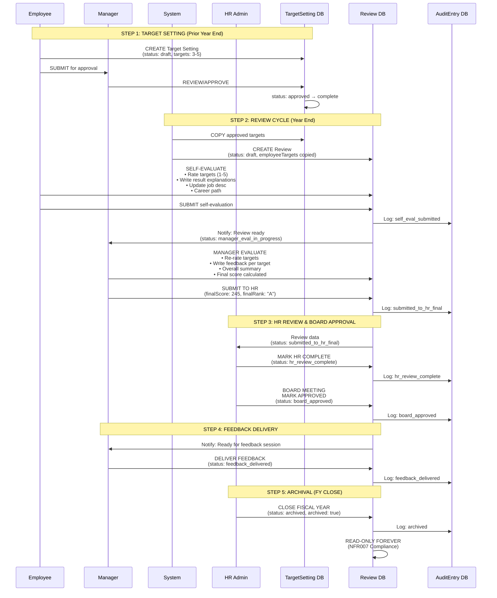

# Database Schema Visualization

## Entity Relationship Diagram (ERD)

```
┌─────────────────────────────────────────────────────────────────────────────┐
│                         DATABASE SCHEMA (11 TABLES)                         │
└─────────────────────────────────────────────────────────────────────────────┘

┌──────────────────────────┐
│         USER             │  Central entity for all actors
├──────────────────────────┤
│ PK id: uuid              │
│    email: string (UQ)    │
│    username: string (UQ) │ ◄─── Credentials auth
│    passwordHash: string  │
│    fullName: string      │
│    roles: string[]       │ ◄─── ["employee","manager","hr_admin","general_director","board_manager"]
│                          │
│    ldapDN: string (UQ)   │ ◄─── Future LDAP
│    ldapSyncedAt: date    │
│    authProvider: string  │
│                          │
│ FK managerId: uuid       │ ◄─── Self-reference (manager)
│    grade: string         │
│    department: string    │
│    employeeId: string    │
│    jobTitle: string      │
│    employmentStatus: str │
│                          │
│    createdAt: datetime   │
│    updatedAt: datetime   │
└────────┬─────────────────┘
         │
         │ 1:N (manager → direct reports)
         ├──────────────────────────────────────┐
         │                                      │
         │ 1:N (reviewee)          1:N (reviewer)
         ├──────────────┐          ┌────────────┤
         │              │          │            │
         ▼              ▼          ▼            │
┌─────────────────┐  ┌─────────────────────┐   │
│ TARGETSETTING   │  │      REVIEW         │   │
├─────────────────┤  ├─────────────────────┤   │
│ PK id: uuid     │  │ PK id: uuid         │   │
│ FK employeeId   │  │ FK revieweeId       │ ──┘
│ FK managerId    │  │ FK reviewerId       │
│    cycleYear    │  │    cycleYear        │
│    status       │  │    status           │ ◄─── State machine
│    targets: JSON│  │                     │
│                 │  │ currentJobDesc: txt │
│    submittedAt  │  │ careerPath: txt     │
│    approvedAt   │  │ employeeTargets:JSON│
│    submittedTo  │  │ employeeSubmittedAt │
│       HRAt      │  │                     │
│    createdAt    │  │ managerTargetRatings│
│    updatedAt    │  │ managerFeedback:JSON│
│                 │  │ overallSummary: txt │
│ UQ(employeeId,  │  │ finalScore: float   │
│    cycleYear)   │  │ finalRank: string   │
└─────────────────┘  │ managerSubmittedAt  │
                     │                     │
                     │ archived: boolean   │ ◄─── NFR007
                     │ archivedAt: date    │
                     │ archivedBy: uuid    │
                     │                     │
                     │ createdAt: datetime │
                     │ updatedAt: datetime │
                     │                     │
                     │ UQ(revieweeId,      │
                     │    cycleYear)       │
                     └─────────────────────┘

┌──────────────────────────┐
│    ROLEASSIGNMENT        │  Delegation support
├──────────────────────────┤
│ PK id: uuid              │
│ FK reviewerId: uuid      │ ──┐ Both reference User
│ FK revieweeId: uuid      │ ──┤
│    reason: string        │   │
│    effectiveFrom: date   │   │
│    effectiveTo: date     │   │
│    createdAt: datetime   │   │
│                          │   │
│ IX(reviewerId,           │   │
│    effectiveFrom,        │   │
│    effectiveTo)          │   │
└──────────────────────────┘   │
                               │
┌──────────────────────────┐   │
│      AUDITENTRY          │   │
├──────────────────────────┤   │
│ PK id: uuid              │   │
│ FK actorId: uuid         │ ──┘
│    actorRole: string     │ ◄─── Role used during action
│    action: string        │ ◄─── "submit_review", "switch_role"
│    targetType: string    │ ◄─── "review", "target", "user"
│    targetId: string      │
│    details: JSON         │ ◄─── Diffs, ai_assisted flag, etc.
│    timestamp: datetime   │
│                          │
│ IX(actorId, timestamp)   │
│ IX(targetType, targetId) │
└──────────────────────────┘

┌──────────────────────────┐
│      FISCALYEAR          │  HR Admin config
├──────────────────────────┤
│ PK id: uuid              │
│    year: int (UQ)        │
│    startDate: date       │
│    endDate: date         │
│    isClosed: boolean     │
│    closedAt: datetime    │
│    closedBy: string      │
│    createdAt: datetime   │
└──────────────────────────┘

┌──────────────────────────┐
│      DEPARTMENT          │  HR Admin config
├──────────────────────────┤
│ PK id: uuid              │
│    name: string (UQ)     │
│    headId: string        │
│    createdAt: datetime   │
│    updatedAt: datetime   │
└──────────────────────────┘

┌──────────────────────────┐
│     EMPLOYEETYPE         │  HR Admin config
├──────────────────────────┤
│ PK id: uuid              │
│    type: string (UQ)     │ ◄─── "Engineer", "Back-Office"
│    grades: JSON          │ ◄─── ["G1","G2","G3"]
│    createdAt: datetime   │
│    updatedAt: datetime   │
└──────────────────────────┘

┌──────────────────────────┐
│     SCOREMAPPING         │  HR Admin config
├──────────────────────────┤
│ PK id: uuid              │
│    employeeType: string  │ ─┐
│    grade: string         │ ─┤ Composite unique key
│    mappings: JSON        │  │ ◄─── [{min:0,max:180,rank:"A+"}]
│    createdAt: datetime   │  │
│    updatedAt: datetime   │  │
│                          │  │
│ UQ(employeeType, grade)  │ ─┘
└──────────────────────────┘

┌──────────────────────────┐
│      COMPANYGOAL         │  Story 2.2
├──────────────────────────┤
│ PK id: uuid              │
│    title: string         │
│    description: text     │
│    department: string    │ ◄─── NULL = company-wide
│    cycleYear: int        │
│    createdAt: datetime   │
│    updatedAt: datetime   │
└──────────────────────────┘

┌──────────────────────────┐
│       AICONFIG           │  Story 1.9
├──────────────────────────┤
│ PK id: uuid              │
│    mode: string          │ ◄─── "web" | "local"
│    ollamaUrl: string     │
│    ollamaModel: string   │
│    resultExplanationTmpl │ ◄─── Prompt templates
│    managerFeedbackTmpl   │
│    updatedAt: datetime   │
└──────────────────────────┘
```

## Key Relationships

**1:N Relationships:**
```
User (manager) ──< User (direct reports)
    1 manager can have many direct reports

User (reviewee) ──< Review
    1 employee can have many reviews (1 per year)

User (reviewer) ──< Review
    1 manager can review many employees

User (employee) ──< TargetSetting
    1 employee can have many target sets (1 per year)

User (manager) ──< TargetSetting
    1 manager can approve many target sets

User (actor) ──< AuditEntry
    1 user can have many audit log entries
```

**M:N Relationships (through junction tables):**
```
User (reviewer) ──< RoleAssignment >── User (reviewee)
    Supports temporary delegation:
    Manager A delegates reviewing Employee B to Manager C
    effectiveFrom/effectiveTo provides time-bound delegation
```

## Data Flow: Review Lifecycle



## Data Relationships & Constraints

**Unique Constraints:**
```sql
-- Prevent duplicate reviews per year
UNIQUE(Review.revieweeId, Review.cycleYear)

-- Prevent duplicate target sets per year
UNIQUE(TargetSetting.employeeId, TargetSetting.cycleYear)

-- Ensure unique user identifiers
UNIQUE(User.email)
UNIQUE(User.username)
UNIQUE(User.employeeId)
UNIQUE(User.ldapDN)

-- Prevent duplicate config entries
UNIQUE(Department.name)
UNIQUE(EmployeeType.type)
UNIQUE(FiscalYear.year)
UNIQUE(ScoreMapping.employeeType, ScoreMapping.grade)
```

**Foreign Key Cascades:**
```sql
-- User deletion (should be soft-delete via employmentStatus)
User.managerId → User.id (SET NULL on delete)

-- Review deletion (should be rare, only during draft)
Review.revieweeId → User.id (RESTRICT)
Review.reviewerId → User.id (RESTRICT)

-- TargetSetting deletion (should be rare)
TargetSetting.employeeId → User.id (RESTRICT)
TargetSetting.managerId → User.id (RESTRICT)

-- RoleAssignment deletion (cascade when user deleted)
RoleAssignment.reviewerId → User.id (CASCADE)
RoleAssignment.revieweeId → User.id (CASCADE)

-- AuditEntry (never delete, append-only)
AuditEntry.actorId → User.id (RESTRICT)
```

**Indexes for Performance:**
```sql
-- User lookups
CREATE INDEX idx_user_email ON User(email)
CREATE INDEX idx_user_username ON User(username)
CREATE INDEX idx_user_manager ON User(managerId)
CREATE INDEX idx_user_department ON User(department)

-- Review queries
CREATE INDEX idx_review_reviewee_year ON Review(revieweeId, cycleYear)
CREATE INDEX idx_review_reviewer_status ON Review(reviewerId, status)
CREATE INDEX idx_review_status ON Review(status)
CREATE INDEX idx_review_archived ON Review(archived)

-- Audit queries
CREATE INDEX idx_audit_actor_time ON AuditEntry(actorId, timestamp)
CREATE INDEX idx_audit_target ON AuditEntry(targetType, targetId)
CREATE INDEX idx_audit_action ON AuditEntry(action)

-- Delegation queries
CREATE INDEX idx_role_assignment_reviewer ON RoleAssignment(reviewerId, effectiveFrom, effectiveTo)
```

## JSON Field Structures

**TargetSetting.targets (Array of 3-5 targets):**
```json
[
  {
    "taskDescription": "Improve system performance",
    "kpi": "Reduce page load time by 30%",
    "weight": 30,
    "difficulty": "L2"
  },
  {
    "taskDescription": "Mentor junior developers",
    "kpi": "Conduct 10 mentoring sessions",
    "weight": 20,
    "difficulty": "L1"
  }
  // ... 1-3 more targets (total weight = 100)
]
```

**Review.employeeTargets (Copied from TargetSetting + ratings):**
```json
[
  {
    "taskDescription": "Improve system performance",
    "kpi": "Reduce page load time by 30%",
    "weight": 30,
    "difficulty": "L2",
    "employeeRating": 4,
    "resultExplanation": "Successfully reduced load time by 35%...",
    "aiAssisted": true
  }
  // ... more targets
]
```

**Review.managerTargetRatings (Manager's assessment):**
```json
[
  {
    "targetIndex": 0,
    "managerRating": 4,
    "disagreeReason": null
  },
  {
    "targetIndex": 1,
    "managerRating": 3,
    "disagreeReason": "Only 8 sessions conducted, not 10"
  }
]
```

**Review.managerFeedback (Per-target feedback):**
```json
[
  {
    "targetIndex": 0,
    "feedback": "Excellent work on performance optimization...",
    "aiAssisted": true
  },
  {
    "targetIndex": 1,
    "feedback": "Good effort on mentoring, aim for consistency..."
  }
]
```

**ScoreMapping.mappings (Score to rank conversion):**
```json
[
  {"min": 0, "max": 100, "rank": "C"},
  {"min": 101, "max": 150, "rank": "B"},
  {"min": 151, "max": 180, "rank": "B+"},
  {"min": 181, "max": 230, "rank": "A"},
  {"min": 231, "max": 300, "rank": "A+"}
]
```

**AuditEntry.details (Context-specific metadata):**
```json
{
  "previousStatus": "self_eval_draft",
  "newStatus": "self_eval_submitted",
  "changedFields": ["employeeTargets", "employeeSubmittedAt"],
  "aiAssisted": true,
  "ipAddress": "192.168.1.100"
}
```

## Migration Path: SQLite → PostgreSQL

**Schema Compatibility:**
```typescript
// Prisma schema change (ONLY THIS LINE CHANGES)
datasource db {
  provider = "sqlite"              // MVP
  // provider = "postgresql"       // Production
  url      = env("DATABASE_URL")
}

// Application code: ZERO CHANGES REQUIRED
// Prisma abstracts database differences
```

**Data Migration Command:**
```bash
# Export from SQLite
npx prisma db push --schema=schema-sqlite.prisma

# Migrate data (using Prisma)
npx prisma migrate deploy --schema=schema-postgres.prisma

# Verify
npx prisma studio
```

---
