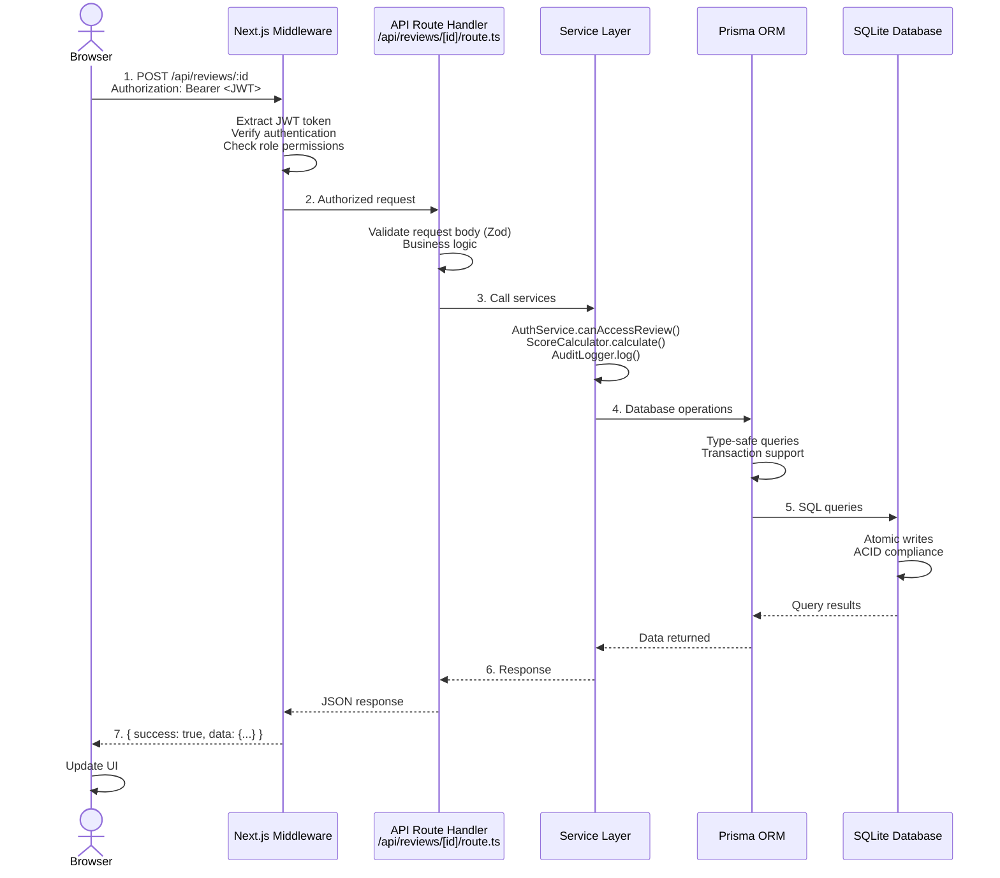
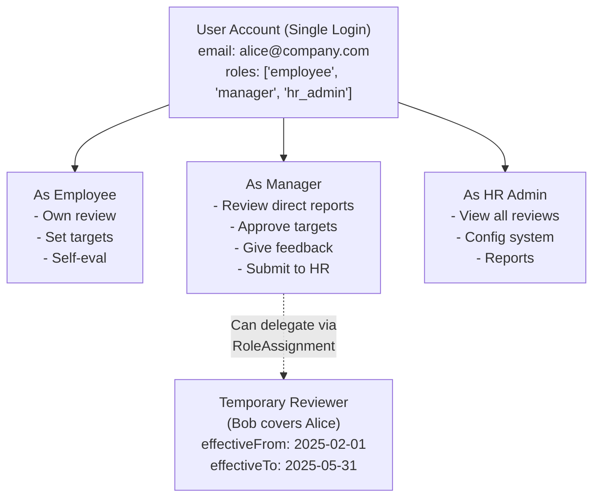
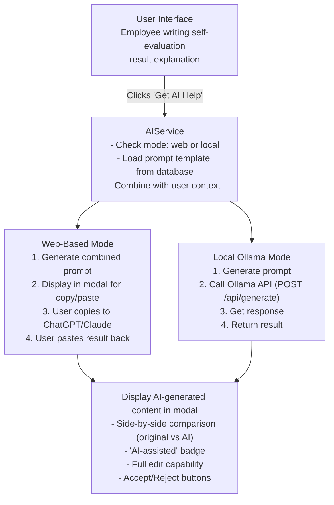
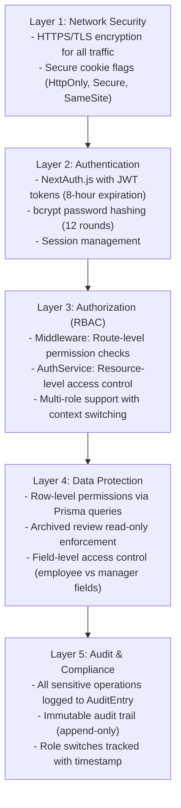

# High-Level Architecture Diagram

## System Architecture Overview

```
┌─────────────────────────────────────────────────────────────────────┐
│                         Client (Browser)                            │
│                                                                     │
│  ┌──────────────┐  ┌──────────────┐  ┌──────────────┐            │
│  │   Employee   │  │   Manager    │  │   HR Admin   │            │
│  │   Dashboard  │  │   Dashboard  │  │   Dashboard  │            │
│  └──────┬───────┘  └──────┬───────┘  └──────┬───────┘            │
│         │                  │                  │                     │
│         └──────────────────┴──────────────────┘                     │
│                            │                                        │
│              React Components (shadcn/ui)                          │
│              Zustand (Client State)                                │
│              TanStack Query (Data Fetching)                        │
└────────────────────────────┬────────────────────────────────────────┘
                             │ HTTPS
                             │
┌────────────────────────────▼────────────────────────────────────────┐
│                    Next.js 14+ App Router                           │
│                    (Single Server - MVP)                            │
│                                                                     │
│  ┌─────────────────────────────────────────────────────────────┐  │
│  │                  Frontend (React SSR)                       │  │
│  │  - Server Components for data fetching                     │  │
│  │  - Client Components for interactivity                     │  │
│  │  - Glassmorphism UI with Tailwind                         │  │
│  └─────────────────────────────────────────────────────────────┘  │
│                             │                                       │
│  ┌─────────────────────────┴───────────────────────────────────┐  │
│  │               API Routes (Backend)                          │  │
│  │                                                             │  │
│  │  ┌──────────────┐  ┌──────────────┐  ┌──────────────┐    │  │
│  │  │    /auth     │  │   /reviews   │  │   /targets   │    │  │
│  │  │  NextAuth.js │  │   Business   │  │   Business   │    │  │
│  │  │   JWT Auth   │  │    Logic     │  │    Logic     │    │  │
│  │  └──────┬───────┘  └──────┬───────┘  └──────┬───────┘    │  │
│  │         │                  │                  │             │  │
│  │  ┌──────┴──────────────────┴──────────────────┴─────────┐ │  │
│  │  │            Middleware (RBAC Enforcement)             │ │  │
│  │  └──────────────────────┬───────────────────────────────┘ │  │
│  │                         │                                  │  │
│  │  ┌──────────────────────▼───────────────────────────────┐ │  │
│  │  │            Service Layer                             │ │  │
│  │  │  - AuthService (RBAC logic)                         │ │  │
│  │  │  - AIService (Dual-mode AI)                         │ │  │
│  │  │  - ScoreCalculator                                  │ │  │
│  │  │  - AuditLogger                                      │ │  │
│  │  └──────────────────────┬───────────────────────────────┘ │  │
│  └─────────────────────────┼─────────────────────────────────┘  │
│                            │                                      │
│  ┌─────────────────────────▼─────────────────────────────────┐  │
│  │                 Prisma ORM                                │  │
│  │  - Type-safe database queries                            │  │
│  │  - Automatic migrations                                  │  │
│  │  - Database abstraction layer                            │  │
│  └─────────────────────────┬─────────────────────────────────┘  │
└────────────────────────────┼──────────────────────────────────────┘
                             │
         ┌───────────────────┴───────────────────┐
         │                                       │
┌────────▼──────────┐              ┌────────────▼──────────┐
│   SQLite (MVP)    │              │  Ollama AI (Optional) │
│   - File-based    │              │  - Local inference    │
│   - ./dev.db      │              │  - Port 11434         │
│   - Daily backups │              │  - llama2 model       │
└───────────────────┘              └───────────────────────┘
         │
         │ (Future Migration)
         │
┌────────▼──────────┐
│   PostgreSQL      │
│   - Production    │
│   - Managed DB    │
│   - Cloud-hosted  │
└───────────────────┘
```

## Data Flow Architecture

**User Request Flow (Example: Employee submits self-review)**



## Multi-Role Access Control Flow



## AI Integration Architecture



## Security Layers



## Review Workflow State Machine

The review process follows a strict state machine with role-based transitions:

```
┌─────────────────────────────────────────────────────────────────────────────┐
│                         REVIEW WORKFLOW STATE MACHINE                       │
└─────────────────────────────────────────────────────────────────────────────┘

                    ┌──────────────────────┐
                    │  SELF_EVAL_DRAFT     │ ◄─── Initial State
                    │  (Employee edits)    │
                    └──────────┬───────────┘
                               │ Employee: "Submit Self-Evaluation"
                               │ Validation: All targets rated, result explanations provided
                               ▼
                    ┌──────────────────────┐
                    │ SELF_EVAL_SUBMITTED  │
                    │  (Read-only)         │
                    └──────────┬───────────┘
                               │ System: Auto-transition
                               │ Action: Notify manager
                               ▼
                    ┌──────────────────────────┐
                    │ MANAGER_EVAL_IN_PROGRESS │
                    │  (Manager edits)         │
                    └──────────┬───────────────┘
                               │ Manager: "Submit Manager Evaluation"
                               │ Validation: All targets rated, feedback provided, score calculated
                               ▼
                    ┌──────────────────────┐
                    │ MANAGER_EVAL_COMPLETE│
                    │  (Read-only)         │
                    └──────────┬───────────┘
                               │ Manager: "Submit to HR"
                               │ Action: Calculate final score & rank
                               ▼
                    ┌──────────────────────┐
                    │ SUBMITTED_TO_HR_FINAL│
                    │  (HR Admin reviews)  │
                    └──────────┬───────────┘
                               │ HR Admin: "Mark as HR Complete"
                               │ Validation: Review verified, no data issues
                               ▼
                    ┌──────────────────────┐
                    │  HR_REVIEW_COMPLETE  │
                    │  (Ready for board)   │
                    └──────────┬───────────┘
                               │ HR Admin: "Mark as Board Approved"
                               │ (After board meeting)
                               ▼
                    ┌──────────────────────┐
                    │   BOARD_APPROVED     │
                    │  (Ready to deliver)  │
                    └──────────┬───────────┘
                               │ Manager: "Deliver Feedback"
                               │ Action: Feedback session with employee
                               ▼
                    ┌──────────────────────┐
                    │  FEEDBACK_DELIVERED  │
                    │  (Review complete)   │
                    └──────────┬───────────┘
                               │ HR Admin: "Archive Review"
                               │ Action: Close fiscal year, mark read-only
                               ▼
                    ┌──────────────────────┐
                    │      ARCHIVED        │ ◄─── Final State
                    │  (Read-only forever) │      (NFR007 Compliance)
                    └──────────────────────┘
```

**State Transition Rules:**

| From State | To State | Actor | Validation | Actions |
|------------|----------|-------|------------|---------|
| `self_eval_draft` | `self_eval_submitted` | Employee | All targets rated (1-5), result explanations provided | Notify manager via email/dashboard |
| `self_eval_submitted` | `manager_eval_in_progress` | System | Auto (immediate) | Update manager's todo list |
| `manager_eval_in_progress` | `manager_eval_complete` | Manager | All targets re-rated, feedback per target, overall summary | Calculate preliminary score |
| `manager_eval_complete` | `submitted_to_hr_final` | Manager | Final score calculated, rank assigned | Notify HR Admin, add to HR queue |
| `submitted_to_hr_final` | `hr_review_complete` | HR Admin | Data integrity check passed | Mark as ready for board |
| `hr_review_complete` | `board_approved` | GD/BOM | Board meeting occurred | Notify manager to schedule feedback session |
| `board_approved` | `feedback_delivered` | Manager | Feedback session completed | Log delivery timestamp, notify employee |
| `feedback_delivered` | `archived` | HR Admin | Fiscal year closed | Set `archived=true`, prevent modifications (except HR flags) |

**State Permissions:**

| State | Employee | Manager | HR Admin | GD/BOM |
|-------|----------|---------|----------|--------|
| `self_eval_draft` | Read/Write | Read | Read | Read |
| `self_eval_submitted` | Read | Read | Read | Read |
| `manager_eval_in_progress` | Read | Read/Write | Read | Read |
| `manager_eval_complete` | Read | Read | Read | Read |
| `submitted_to_hr_final` | Read | Read | Read/Write (minimal) | Read |
| `hr_review_complete` | Read | Read | Read | Read/Write (approve) |
| `board_approved` | Read | Read | Read | Read |
| `feedback_delivered` | Read | Read | Read | Read |
| `archived` | Read | Read | Read + Flag issues | Read |

**Implementation Example:**

```typescript
// src/lib/workflows/review-state-machine.ts
export const REVIEW_STATES = {
  SELF_EVAL_DRAFT: 'self_eval_draft',
  SELF_EVAL_SUBMITTED: 'self_eval_submitted',
  MANAGER_EVAL_IN_PROGRESS: 'manager_eval_in_progress',
  MANAGER_EVAL_COMPLETE: 'manager_eval_complete',
  SUBMITTED_TO_HR_FINAL: 'submitted_to_hr_final',
  HR_REVIEW_COMPLETE: 'hr_review_complete',
  BOARD_APPROVED: 'board_approved',
  FEEDBACK_DELIVERED: 'feedback_delivered',
  ARCHIVED: 'archived'
} as const

export const VALID_TRANSITIONS: Record<string, string[]> = {
  [REVIEW_STATES.SELF_EVAL_DRAFT]: [REVIEW_STATES.SELF_EVAL_SUBMITTED],
  [REVIEW_STATES.SELF_EVAL_SUBMITTED]: [REVIEW_STATES.MANAGER_EVAL_IN_PROGRESS],
  [REVIEW_STATES.MANAGER_EVAL_IN_PROGRESS]: [REVIEW_STATES.MANAGER_EVAL_COMPLETE],
  [REVIEW_STATES.MANAGER_EVAL_COMPLETE]: [REVIEW_STATES.SUBMITTED_TO_HR_FINAL],
  [REVIEW_STATES.SUBMITTED_TO_HR_FINAL]: [REVIEW_STATES.HR_REVIEW_COMPLETE],
  [REVIEW_STATES.HR_REVIEW_COMPLETE]: [REVIEW_STATES.BOARD_APPROVED],
  [REVIEW_STATES.BOARD_APPROVED]: [REVIEW_STATES.FEEDBACK_DELIVERED],
  [REVIEW_STATES.FEEDBACK_DELIVERED]: [REVIEW_STATES.ARCHIVED],
  [REVIEW_STATES.ARCHIVED]: [] // Terminal state
}

export class ReviewStateMachine {
  static canTransition(currentState: string, targetState: string): boolean {
    const validNextStates = VALID_TRANSITIONS[currentState] || []
    return validNextStates.includes(targetState)
  }
  
  static async transition(
    reviewId: string, 
    targetState: string,
    actorId: string,
    actorRole: string
  ): Promise<Review> {
    const review = await prisma.review.findUnique({ where: { id: reviewId } })
    
    if (!review) {
      throw new Error('Review not found')
    }
    
    // Validate transition
    if (!this.canTransition(review.status, targetState)) {
      throw new Error(
        `Invalid state transition: ${review.status} → ${targetState}`
      )
    }
    
    // Validate actor permissions
    if (!this.canActorTransition(review, targetState, actorId, actorRole)) {
      throw new Error('Actor not authorized for this transition')
    }
    
    // Perform validation for target state
    this.validateStateRequirements(review, targetState)
    
    // Execute transition with audit log
    return await prisma.$transaction(async (tx) => {
      const updatedReview = await tx.review.update({
        where: { id: reviewId },
        data: { 
          status: targetState,
          ...(targetState === REVIEW_STATES.ARCHIVED && {
            archived: true,
            archivedAt: new Date(),
            archivedBy: actorId
          })
        }
      })
      
      // Log state transition
      await tx.auditEntry.create({
        data: {
          actorId,
          actorRole,
          action: 'state_transition',
          targetType: 'review',
          targetId: reviewId,
          details: {
            fromState: review.status,
            toState: targetState,
            timestamp: new Date()
          }
        }
      })
      
      // Execute post-transition actions
      await this.executePostTransitionActions(updatedReview, targetState)
      
      return updatedReview
    })
  }
  
  private static canActorTransition(
    review: Review,
    targetState: string,
    actorId: string,
    actorRole: string
  ): boolean {
    const transitionPermissions = {
      [REVIEW_STATES.SELF_EVAL_SUBMITTED]: ['employee'],
      [REVIEW_STATES.MANAGER_EVAL_COMPLETE]: ['manager'],
      [REVIEW_STATES.SUBMITTED_TO_HR_FINAL]: ['manager'],
      [REVIEW_STATES.HR_REVIEW_COMPLETE]: ['hr_admin'],
      [REVIEW_STATES.BOARD_APPROVED]: ['general_director', 'board_manager'],
      [REVIEW_STATES.FEEDBACK_DELIVERED]: ['manager'],
      [REVIEW_STATES.ARCHIVED]: ['hr_admin']
    }
    
    const allowedRoles = transitionPermissions[targetState] || []
    return allowedRoles.includes(actorRole)
  }
  
  private static validateStateRequirements(review: Review, targetState: string) {
    switch (targetState) {
      case REVIEW_STATES.SELF_EVAL_SUBMITTED:
        // Must have all targets rated
        const targets = JSON.parse(review.employeeTargets || '[]')
        if (targets.length === 0 || targets.some(t => !t.rating || !t.resultExplanation)) {
          throw new Error('All targets must be rated with result explanations')
        }
        break
        
      case REVIEW_STATES.MANAGER_EVAL_COMPLETE:
        // Must have manager ratings and feedback
        if (!review.managerTargetRatings || !review.managerFeedback) {
          throw new Error('Manager must provide ratings and feedback for all targets')
        }
        if (!review.overallSummary) {
          throw new Error('Manager must provide overall summary')
        }
        break
        
      case REVIEW_STATES.SUBMITTED_TO_HR_FINAL:
        // Must have final score and rank
        if (review.finalScore === null || !review.finalRank) {
          throw new Error('Final score and rank must be calculated')
        }
        break
    }
  }
  
  private static async executePostTransitionActions(
    review: Review, 
    targetState: string
  ) {
    switch (targetState) {
      case REVIEW_STATES.SELF_EVAL_SUBMITTED:
        // Notify manager
        await NotificationService.notifyManager(review.reviewerId, review.id)
        break
        
      case REVIEW_STATES.SUBMITTED_TO_HR_FINAL:
        // Add to HR queue
        await NotificationService.notifyHRTeam(review.id)
        break
        
      case REVIEW_STATES.BOARD_APPROVED:
        // Notify manager to schedule feedback
        await NotificationService.notifyManagerForFeedback(review.reviewerId, review.id)
        break
        
      case REVIEW_STATES.FEEDBACK_DELIVERED:
        // Notify employee
        await NotificationService.notifyEmployeeFeedbackReady(review.revieweeId, review.id)
        break
    }
  }
  
  static getAvailableTransitions(currentState: string, userRole: string): string[] {
    const allNextStates = VALID_TRANSITIONS[currentState] || []
    
    // Filter by role permissions
    return allNextStates.filter(state => {
      const transitionPermissions = {
        [REVIEW_STATES.SELF_EVAL_SUBMITTED]: ['employee'],
        [REVIEW_STATES.MANAGER_EVAL_COMPLETE]: ['manager'],
        [REVIEW_STATES.SUBMITTED_TO_HR_FINAL]: ['manager'],
        [REVIEW_STATES.HR_REVIEW_COMPLETE]: ['hr_admin'],
        [REVIEW_STATES.BOARD_APPROVED]: ['general_director', 'board_manager'],
        [REVIEW_STATES.FEEDBACK_DELIVERED]: ['manager'],
        [REVIEW_STATES.ARCHIVED]: ['hr_admin']
      }
      
      const allowedRoles = transitionPermissions[state] || []
      return allowedRoles.includes(userRole)
    })
  }
}
```

**Usage in API Routes:**

```typescript
// src/app/api/reviews/[id]/submit/route.ts
export async function POST(request: NextRequest, { params }: { params: { id: string } }) {
  const session = await getServerSession(authOptions)
  const { targetState } = await request.json()
  
  try {
    const review = await ReviewStateMachine.transition(
      params.id,
      targetState,
      session.user.id,
      session.user.currentRole // From role-switching context
    )
    
    return NextResponse.json(createSuccessResponse(review))
  } catch (error) {
    return NextResponse.json(
      createErrorResponse(error.message, 'TRANSITION_ERROR'),
      { status: 400 }
    )
  }
}
```

**Benefits of State Machine Pattern:**
- ✅ **Enforces valid workflow** - Prevents invalid state transitions
- ✅ **Role-based permissions** - Only authorized users can trigger transitions
- ✅ **Audit trail** - Every state change is logged
- ✅ **Validation** - Ensures data completeness before advancing
- ✅ **Testable** - Easy to test all valid/invalid transitions
- ✅ **Self-documenting** - State diagram serves as living documentation

---
